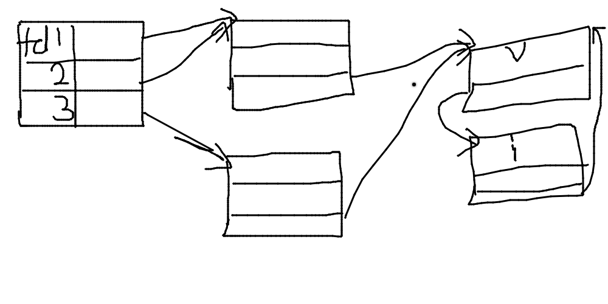

# 文件 I/O

## 随书代码

### 3.6.c

```shell
$ gcc 3.6.c -lapue
$ ./a.out
seek OK
$ cat < /etc/passwd | ./a.out
cannot seek
```

如果文件描述符指向的是一个管道、 FIFO 或网络套接字，则 lseek 返回 -1

因为偏移量可能为负值，因此在比较 lseek 的返回值的时候，不应该测试它是否小于 0 ，而是应该测试它是否等于 -1

### 3.6.2.c

```shell
$ gcc 3.6.2.c -lapue
$ ./a.out
$ ls -l file.hole
-rw-r--r--  1 meik  staff  16394 Apr 21 21:27 file.hole
$ od -c file.hole
0000000    a   b   c   d   e   f   g   h   i   j  \0  \0  \0  \0  \0  \0
0000020   \0  \0  \0  \0  \0  \0  \0  \0  \0  \0  \0  \0  \0  \0  \0  \0
*
0040000    A   B   C   D   E   F   G   H   I   J
0040012
$ ls -ls file.hole
40 -rw-r--r--  1 meik  staff  16394 Apr 21 21:32 file.hole
```

在我的系统（ MacOS ）下，占用磁盘块的个数与文件大小正相关，并没有因为空洞的存在而有改变，原因不明……

### 3.9.c

创建了一个大小为 516 581 760 字节的文件，实际测试代码

```C
#define BUFFSIZE 4096
```

```shell
$ gcc 3.9.c -lapue
$ time ./a.out < file.hole > /dev/null

real    0m0.428s
user    0m0.128s
sys     0m0.283s

```

---

```C
#define BUFFSIZE 64
```

```shell
$ gcc 3.9.c -lapue
$ time ./a.out < file.hole > /dev/null

real    0m21.694s
user    0m7.867s
sys     0m11.943s

```

其余的没有测试，从这两个就已经能够明显的看出差别了

### 3.10

内核使用 3 中数据结构表示打开文件，它们之间的关系决定了在文件共享方面一个进程对另一个进程可能产生的影响。

1. 每个进程在进程表里都有一个记录项，记录项中包含一张打开文件描述符表，可将其视为一个矢量，每个描述符占用一项。与每个文件描述符相关联的是：
  a. 文件描述符标志（ close_on_exec ）
  b. 指向一个文件表项的指针
2. 内核为所有打开文件维持一张文件表。每个文件表项包括：
  a. 文件状态标志（读、写、添写、同步和非阻塞等）
  b. 当前文件偏移量
  c. 指向该文件 v 节点表项的指针
3. 每个打开文件（或设备）都有一个 v 节点（ v-node ）结构。 v 节点包含了文件类型和对此文件进行各种操作函数的指针。对于大多数文件， v 节点还包含了该文件的 i 节点（ i-node ，索引节点）。这些信息是在打开文件时从磁盘上读入内存的，所以，文件的所有相关信息都是随时可用的。例如： i 节点包含了文件的所有者、文件长度、指向文件实际数据块在磁盘上所在位置的指针等。

### 3.11

**任何要求多于一个函数调用的操作都不是原子操作，因为在两个函数调用之间，内核有可能会临时挂起进程**  
*pwrite* 和 *pread* 可以原子性的定位并执行 I/O

调用时，无法中断其定位和操作；不更新当前文件偏移量

### 3.12

*dup* 和 *dup2* 函数可以用来复制一个现有的文件描述符

```C
#include <unistd.h>

int dup(int fd);

int dup2(int fd, int fd2);
```

由 dup 返回的新文件描述符一定是当前可用文件描述符中的最小数值。对于 dup2 ，可以用 fd2 参数指定新描述符的值。如果 fd2 已经打开，则先将其关闭。如果 fd 等于 fd2 ，则 dup2 返回 fd2 ，而不关闭它。否则， fd2 的 FD_CLOEXEC 文件描述符标志就被清除，这样 fd2 在进程调用 exec 时是打开状态

这些函数返回的新文件描述符与参数 fd 共享同一个文件表项，具体使用见 [3.12.c](3.12.c)

### 3.14

函数 fcntl 可以改变已经打开文件的属性

```C
#include <fcntl.h>

int fcntl(int fd, int cmd, ... /* int arg */);
```

1. 复制一个已有的描述符（ cmd=F_DUPFD 或 F_DUPFD_CLOEXEC ）
2. 获取 / 设置文件描述符标志（ cmd=F_GETFD 或 F_SETFD ）
3. 获取 / 设置文件状态标注（ cmd=F_GETFL 或 F_SETFL ）
4. 获取 / 设置异步 I/O 所有权（ cmd=F_GETOWN 或 F_SETOWN ）
5. 获取 / 设置记录锁（ cmd=F_GETLK 、 F_SETLK 或 F_SETLKW ）

代码 [3.14.c](3.14.c) 可用于打印指定的描述符的文件标志

```shell
$ gcc 3.14.c -lapue
$ ./a.out 0 < /dev/tty
read only
$ ./a.out 1 > temp.foo
$ ./a.out 1
read write
$ ./a.out 2 2>>temp.foo
write only, append
$ ./a.out 5 5<>temp.foo
read write

```

## 习题

### 3.1

**当读/写磁盘文件时，本章中描述的函数确实是不带缓冲机制的吗？请说明原因**  
按书中的说法是带有缓冲机制的,

1. 如read的时候，大多数的文件系统为改变性能都采用某种预读(read ahead)技术, 当检测到正在进行顺序读取时，系统就试图读入比应用所要求的更多数据.
2. 通常write只是将数据排入队列，而实际的写磁盘操作则可能在以后的某个时刻进行。 而数据库系统则需要使用O_SYNC，这样一来当它从write返回时就知道数据已确实写到磁盘上， 以免在系统异常是产生数据丢失

标准答案：

所有磁盘 I/O 都要经过内核的块缓冲区（也称为内核的缓冲区高速缓存）。唯一例外的是对原始磁盘设备的 I/O ，但是我们不考虑这种情况。既然 read 或 write 的数据都要被内核缓冲，那么术语“不带缓冲的 I/O ”指的是在用户的进程中对这两个函数不会自动缓冲，每次 read 或 write 就要进行一次系统调用。

### 3.2
**编写一个与 3.12 节中 dup2 功能相同的函数，要求不调用 fcntl 函数，并且要有正确的出错处理**  
[p2.c](p2.c)

```shell
$ gcc p2.c
$ ./a.out
create fd 3
create fd 4
create fd 5
create fd 6
create fd 7
create fd 8
create fd 9
create fd 10
create fd 11
create fd 12
create fd 13
create fd 14
close fd 3
close fd 4
close fd 5
close fd 6
close fd 7
close fd 8
close fd 9
close fd 10
close fd 11
close fd 12
close fd 13
close fd 14
Hello World!
```

### 3.3

**假设一个进程执行下面 3 个函数调用：**

```C
fd1 = open(path, oflags);
fd2 = dup(fd1);
fd3 = open(path, oflags);
```

**画出类似于图 3-9 的结果图。对 fcntl 作用于 fd1 来说， F_SETFD 命令会影响哪一个文件描述符？ F_SETFL 呢？**  


1. F_SETFD标志是文件描述符标记，只作用于一个进程的一个描述符，所以对于fctnl作用于fd1来说，只会影响fd1。
2. F_SETFL标志是文件状态标记，作用于任何进程中的所有描述符，所以对于fctnl作用于fd1来说，会影响fd1，fd2。

验证可以看 [p3.c](p3.c)

### 3.4

**许多程序中都包含下面一段代码：**  

```C
dup2(fd, 0);
dup2(fd, 1);
dup2(fd, 2);
if (fd > 2)
    close(fd);
```

**为了说明 if 语句的必要性，假设 fd 是 1 ，画出每次调用 dup2 时 3 个描述符项及相应的文件表项的变化情况。然后再画出 fd 为 3 的情况。**  
若 fd 为 1 ，则调用 dup2 后，0、1、2 描述符都指向 1 所指向的文件表项，其中第二条 dup2 不会进行任何操作，会直接返回。此时共有三个 fd 标志，指向同一个文件表项

若 fd 为 3 ，则调用 dup2 后，0、1、2 描述符都指向 3 所指向的文件表项。此时共有四个 fd 标志，同时指向 3 指向的文件表项

### 3.5

**在 Bourne shell 、 Bourne-again shell 和 Korn shell 中， digit1 > digit2 表示要将描述符 digit1 重定向至描述符 digit2 的同一文件。请说明下面两条命令的区别。**  

```shell
./a.out > outfile 2>&1
./a.out 2>&1 > outfile
```

**在Unix中,2>&1类似于 dup2(fd1,fd2) 函数，2>&1是将标准错误输出重定向到标准输出。**  
[p5.c](p5.c)

```shell
$ gcc p5.c
$ ./a.out
Hello World!
$ ./a.out > outfile 2>&1
$ cat outfile
Hello World!
$ rm outfile
$ ./a.out 2>&1 > outfile
World!
$ cat outfile
Hello
```

可见，第一种写法会先把 stdout 重定向到文件中，然后再把 stderr 重定向于 stdout 所指向的文件
而第二种方式会把 stderr 重定向到标准输出，然后把标准输出重定向到文件。

我们再做一些观察
```
$ ./a.out
Hello World!
$ ./a.out > outfile
World!
$ cat outfile
Hello
```
可以知道缺省的stderr和stdout都指向shell,然后第一个`>`一般是指对stdout的重定向

如果用 dup2 函数来表示的话，两个写法对应的代码分别是：

- 第一种

```C
dup2(fileno, STDOUT_FILENO);  //  STDOUT_FILENO 此时等于对应文件的描述符
dup2(STDOUT_FILENO, STDERR_FILENO);  // STDERR_FILENO 等于 STDOUT_FILENO ，也就是等于对应文件的描述符，因此此时 stdout 和 stderr 都会被输出到文件
```

- 第二种

```C
dup2(STDERR_FILENO, STDOUT_FILENO);  // STDERR_FILENO 等于 STDOUT_FILENO ， stderr 会被输出到标准输出
dup2(STDOUT_FILENO, fileno);  // STDOUT_FILENO 等于 fileno ， stdout 会被输出到文件
```

#### 复习一下dup2

借鉴自：https://blog.csdn.net/bian_qing_quan11/article/details/73304911
原型：int dup2(int oldfd, int newfd);

参数：oldfd是一个文件描述符

            newfd一个文件描述符

返回值：

功能：将newfd指向oldfd所指的文件，相当于重定向功能。如果newfd已经指向一个已经打开的文件，那么他会首先关闭这个文件，然后在使newfd指向oldfd文件；

            如果newfd和oldfd指向同一个文件，那么不会关闭，直接返回。


### 3.6

**如果使用追加标志打开一个文件以便读、写，能否仍用 lseek 在任一位置开始读？能否用 lseek 更新文件中任一部分的数据？请编写一段程序验证**  
编写 [p6.c](p6.c) ，创建空文件 test.txt ，查看运行结果：

```shell
$ gcc p6.c
$ ./a.out
World!
Hello
$ cat test.txt
World!
Hello
```

由此可见， lseek 可以在任一位置读，但由追加标志打开的文件只能在尾端写入。
